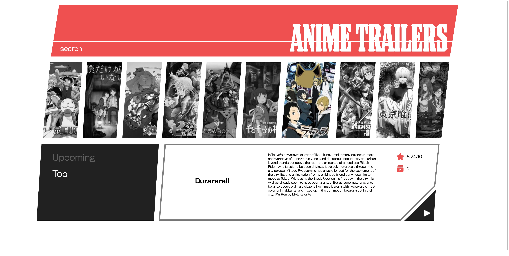
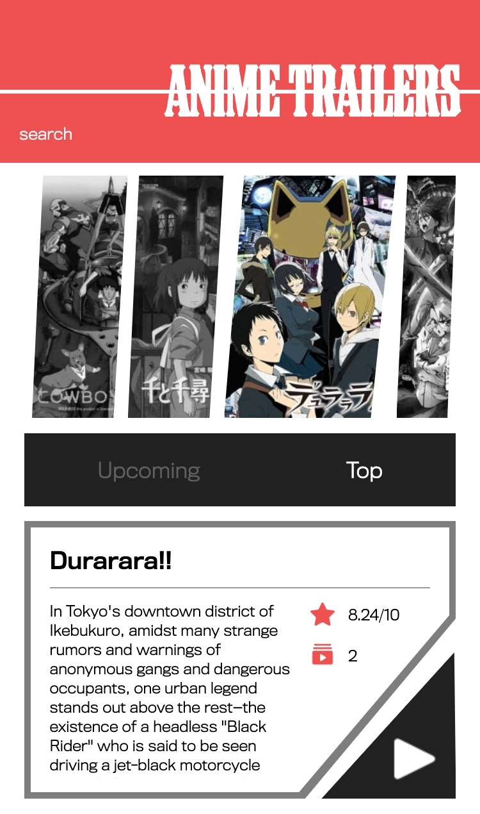

# ANIME TRAILERS

## Inspiration

Sometimes I struggle finding new anime to dive into watching that interests me and im sure its a problem for other fans of anime as well, so I  wanted to create a web page that let me explore new and current anime and get a preview of it right on the spot. Instead of having to go search the web for trailers and promos and having to deal with finding the right season Its all available right in this web app.

## Description 

This web app allows the user to find trailers and promo videos from a selection of top or upcoming anime or allows the user to search for a specific anime. It provides a quick way to discover new animes to watch and instantly get an idea if you are interested in investing your time in watching it.

## Screenshots
Landing page:

Responsive Layout: 

## Demo

- [Live Demo](https://anime-trailers-next.now.sh/)

## Technology 
-HTML
-CSS
-JavaScript
-React
-Next.JS

## APIs Used

Jikan Rest API:
- []https://jikan.docs.apiary.io/
